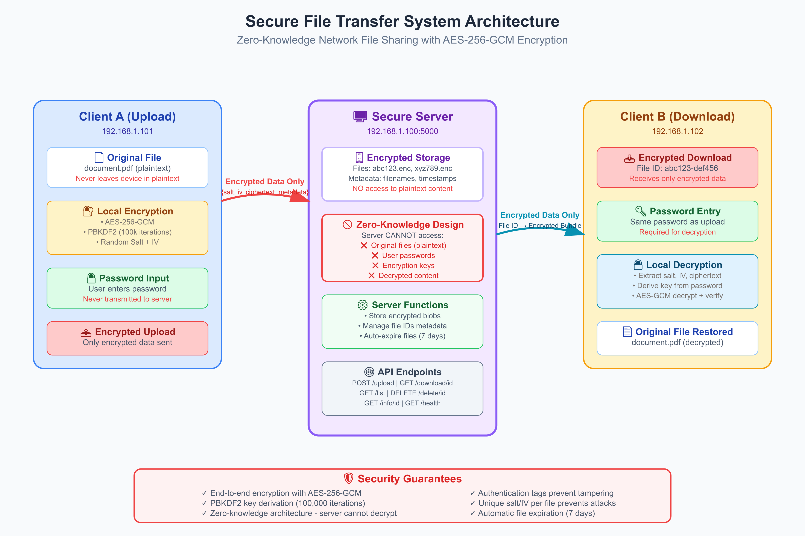

# 🔐 Secure File Transfer System

A zero-knowledge encrypted file sharing system with enterprise-grade security features including audit logging, rate limiting, and owner-based access control.

## 🌟 Features

- **🔒 Zero-Knowledge Architecture**: Files are encrypted/decrypted entirely on the client side
- **🛡️ Military-Grade Encryption**: AES-256-GCM with authentication and integrity protection
- **🔑 Strong Key Derivation**: PBKDF2 with SHA-256 and 100,000 iterations
- **🌐 Network Sharing**: Share encrypted files across local networks or internet
- **👤 Owner-Based Access Control**: Only file uploaders can delete their files
- **🚦 Rate Limiting**: DDoS protection with configurable limits
- **📊 Comprehensive Audit Logging**: All operations logged for security monitoring
- **🔍 Client Fingerprinting**: Additional layer of owner verification
- **⏰ Auto-Expiration**: Files automatically expire after 7 days
- **📱 Cross-Platform**: Works on Windows, macOS, and Linux
- **🚫 No Password Recovery**: True zero-knowledge - server never sees passwords
- **📁 File Management**: List, download, delete, and get info on files with metadata

## 🏗️ Architecture

```
┌─────────────┐    Encrypted File    ┌─────────────┐    Encrypted File    ┌─────────────┐
│   Client A  │ ◄──────────────────► │   Server    │ ◄──────────────────► │   Client B  │
│ (Encrypt)   │                      │ (Storage)   │                      │ (Decrypt)   │
└─────────────┘                      └─────────────┘                      └─────────────┘
      ▲                                      │                                      ▲
      │ Password                             │ No Access to:                       │ Password
      │ (Local Only)                         │ • Plaintext Files                   │ (Local Only)
      └──────────────────────────────────────┤ • Passwords                         └──────────
                                             │ • Encryption Keys
                                             └─ Only Stores Encrypted Data
```

The system implements a zero-knowledge architecture where:
- **Clients** handle all encryption/decryption locally
- **Server** stores only encrypted data and metadata
- **Network** transmits only encrypted content
- **Passwords** never leave the client device



## 🚀 Quick Start

### Prerequisites

- Python 3.8 or higher
- pip (Python package installer)

### Installation

1. **Clone the repository**
   ```bash
   git clone https://github.com/its-dedsec/Secure-Share.git
   cd Secure-Share
   ```

2. **Install dependencies**
   ```bash
   pip install -r requirements.txt
   ```

3. **Make scripts executable** (Linux/macOS)
   ```bash
   chmod +x secure_server.py secure_client.py
   ```

### Basic Usage

1. **Start the server** (on one computer)
   ```bash
   # Development server (localhost only)
   python secure_server.py
   
   # Production server (accessible to network)
   python secure_server.py --host 0.0.0.0 --port 5000
   ```

2. **Upload a file** (from any computer on the network)
   ```bash
   python secure_client.py upload document.pdf --server http://SERVER_IP:5000
   ```

3. **Share and download** (from any other computer)
   ```bash
   # List available files
   python secure_client.py list --server http://SERVER_IP:5000
   
   # Download file using File ID
   python secure_client.py download <FILE_ID> --server http://SERVER_IP:5000
   ```

## 📖 Detailed Usage

### Server Commands

```bash
# Basic server
python secure_server.py

# Production server (all interfaces)
python secure_server.py --host 0.0.0.0 --port 5000

# Custom configuration
python secure_server.py \
    --host 0.0.0.0 \
    --port 8080 \
    --storage /secure/file/storage \
    --debug

# Get help
python secure_server.py --help
```

### Client Commands

| Command | Description | Example |
|---------|-------------|---------|
| `upload` | Upload and encrypt file | `python secure_client.py upload document.pdf` |
| `download` | Download and decrypt file | `python secure_client.py download abc123-def456` |
| `list` | List all available files | `python secure_client.py list` |
| `owned` | List files you own | `python secure_client.py owned` |
| `info` | Get file information | `python secure_client.py info abc123-def456` |
| `delete` | Delete owned file | `python secure_client.py delete abc123-def456` |
| `health` | Check server status | `python secure_client.py health` |

#### Upload Example
```bash
python secure_client.py upload family_photos.zip --server http://SERVER_IP:5000

Enter encryption password: ********
Confirm password: ********
✅ File uploaded successfully!
ℹ️  File ID: abc123-def456-ghi789
ℹ️  Owner Token: secret-token-for-management
ℹ️  Share the File ID with others to download
```

#### Download Example
```bash
python secure_client.py download abc123-def456-ghi789 --server http://SERVER_IP:5000

Enter decryption password: ********
✅ File downloaded and decrypted successfully!
📁 Saved as: family_photos.zip
```

## 🔒 Security Features

### Enterprise-Grade Security

- **Zero-Knowledge Encryption**: Files encrypted client-side before upload
- **AES-256-GCM**: Military-grade encryption with authenticated encryption
- **Owner-Based Access Control**: Only file uploaders can delete their files
- **Rate Limiting**: 60 requests/minute, 1000 requests/hour per IP
- **Comprehensive Audit Logging**: JSON-formatted security event logs
- **Client Fingerprinting**: IP + User-Agent based owner verification
- **Automatic File Expiry**: Files deleted after 7 days by default

### Cryptographic Implementation

| Component | Specification | Purpose |
|-----------|---------------|---------|
| **Encryption** | AES-256-GCM | Confidentiality + Authentication |
| **Key Derivation** | PBKDF2-SHA256 | Password-based key generation |
| **Iterations** | 100,000 | Brute-force resistance |
| **Salt Length** | 16 bytes | Rainbow table prevention |
| **IV Length** | 12 bytes | GCM initialization vector |
| **Max File Size** | 50 MB | Configurable server limit |

### Security Architecture

- **Client-Side Encryption**: All encryption/decryption happens locally
- **Server Blindness**: Server never sees plaintext data or passwords
- **Key Isolation**: Encryption keys never transmitted to server
- **Metadata Protection**: Only filename and size metadata stored
- **Owner Token System**: Secure file management with dual verification

## 📊 Monitoring & Logging

### Audit Log Features

All operations are logged in JSON format with:
- Timestamp and event type
- Client IP and User-Agent
- File operations (upload, download, delete)
- Success/failure status
- Rate limit violations
- Server errors

```bash
# Monitor logs in real-time
tail -f logs/audit.log

# Parse with jq for analysis
tail -f logs/audit.log | jq '.message'

# Filter failed operations
tail -f logs/audit.log | jq 'select(.message.status == "error")'
```

### Event Types Tracked

- `file_upload` - File upload attempts
- `file_download` - File download attempts  
- `file_delete` - File deletion attempts
- `rate_limit_exceeded` - Rate limit violations
- `metadata_load_error` - Server errors
- And more...

## 🌐 Network Setup Examples

### Home Network
```bash
# Server Computer (SERVER_IP)
python secure_server.py --host 0.0.0.0 --port 5000

# Any device on network
python secure_client.py upload document.pdf --server http://SERVER_IP:5000
python secure_client.py list --server http://SERVER_IP:5000
```

### Production Deployment
```bash
# Production server with custom storage
python secure_server.py \
    --host 0.0.0.0 \
    --port 5000 \
    --storage /secure/encrypted/files

# Client access
python secure_client.py upload report.pdf --server https://your-domain.com
```

## 🔧 Configuration

### Server Options

| Option | Default | Description |
|--------|---------|-------------|
| `--host` | `0.0.0.0` | Host interface to bind to |
| `--port` | `5000` | Port number to listen on |
| `--storage` | `./server_storage` | Directory for encrypted file storage |
| `--debug` | `False` | Enable Flask debug mode |

### Client Options

| Option | Description |
|--------|-------------|
| `-s, --server` | Server URL (default: http://localhost:5000) |
| `-o, --output` | Output file path for downloads |
| `--owner-token` | Explicit owner token for operations |
| `--no-banner` | Suppress banner display |

## 🛠️ API Reference

The server exposes RESTful API endpoints:

| Method | Endpoint | Description |
|--------|----------|-------------|
| `GET` | `/api/health` | Health check |
| `POST` | `/api/upload` | Upload encrypted file |
| `GET` | `/api/download/<id>` | Download encrypted file |
| `GET` | `/api/list` | List all files |
| `GET` | `/api/info/<id>` | Get file metadata |
| `DELETE` | `/api/delete/<id>` | Delete file (requires owner token) |

## 📁 File Structure

```
Secure-Share/
├── secure_server.py          # Enhanced server with security features
├── secure_client.py          # Enhanced client with owner token support
├── requirements.txt          # Python dependencies
├── README.md                # This documentation
├── server_storage/          # Encrypted files storage
│   ├── abc123-def456.enc   # Encrypted file data
│   └── metadata.json       # File metadata and expiration
└── logs/                   # Audit logs
    └── audit.log          # Security event log
```

## 🐛 Troubleshooting

### Common Issues

#### Server Connection
```bash
# Check server health
python secure_client.py health --server http://SERVER_IP:PORT

# Test connectivity
ping SERVER_IP
telnet SERVER_IP PORT
```

#### Rate Limiting
```bash
# Error: "Rate limit exceeded"
# Solution: Wait 1 minute or contact admin
```

#### File Not Found
```bash
# Check if file exists
python secure_client.py list --server http://SERVER_IP:PORT

# Check if file expired (7-day default)
python secure_client.py info FILE_ID --server http://SERVER_IP:PORT
```

#### Permission Denied on Delete
```bash
# Only file owners can delete
# Check owned files
python secure_client.py owned --server http://SERVER_IP:PORT
```

### Finding Your Server IP

```bash
# Linux/macOS
hostname -I
ip addr show | grep inet

# Windows
ipconfig
```

## 📈 Best Practices

### Security
- Use strong, unique passwords for each file
- Deploy with HTTPS in production
- Monitor audit logs regularly
- Keep dependencies updated
- Use firewall rules to restrict access

### Operational  
- Regular backups of server storage
- Log rotation for audit logs
- Monitor disk space usage
- Clean up expired files
- Document your deployment

## 🤝 Contributing

1. Fork the repository
2. Create a feature branch (`git checkout -b feature/amazing-feature`)
3. Commit your changes (`git commit -m 'Add amazing feature'`)
4. Push to the branch (`git push origin feature/amazing-feature`)
5. Open a Pull Request

### Development Setup

```bash
# Clone your fork
git clone https://github.com/its-dedsec/Secure-Share.git
cd Secure-Share

# Install dependencies
pip install -r requirements.txt

# Run in development mode
python secure_server.py --debug
```

## 📄 License

This project is licensed under the MIT License - see the [LICENSE](LICENSE) file for details.

## 🙏 Acknowledgments

- Based on cybersecurity internship research at First Vidya Pvt. Ltd.
- Implements security principles from Task 2: Secure File Sharing Systems
- Thanks to the cryptography community for robust security libraries
- Inspired by zero-knowledge security architectures

## Contributors

- **Prathamesh Chandekar**: [LinkedIn](https://www.linkedin.com/in/prathameshc/)
- **Mansi Mehta**: [LinkedIn](https://www.linkedin.com/in/mansismehta/)

## 🔗 Related Projects

- [Cryptography Library](https://cryptography.io/)
- [Flask Framework](https://flask.palletsprojects.com/)
- [NIST Cryptographic Standards](https://csrc.nist.gov/)

---

**⚠️ Security Notice**: This software provides strong encryption for file contents, but metadata (filenames, sizes, upload times) are visible to the server operator. For maximum privacy, consider encrypting sensitive filenames before upload.

**🛡️ Zero-Knowledge Guarantee**: Your files and passwords never leave your device in plaintext form. The server acts only as encrypted storage and cannot access your data.

**🏢 Enterprise Ready**: With comprehensive audit logging, rate limiting, and owner-based access control, this system is suitable for both personal and enterprise use.
